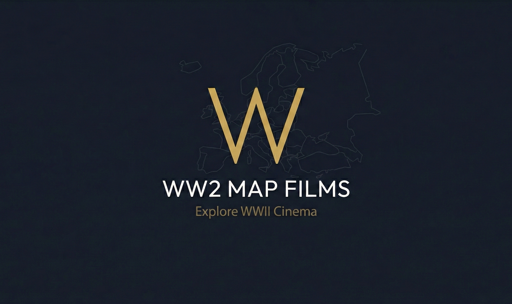

# 🎬 WW2 Film Map

**Explore World War II through the lens of cinema.**

An interactive experience that maps iconic WW2 films to their historical locations and timelines. Discover how cinema has captured the most significant events of 1936-1945.



## ✨ Features

- 🗺️ **Interactive Map**: Navigate through a global map of film locations and historical battlefields.
- ⏳ **Dynamic Timeline**: Visualize the parallel progression of the war and the films that depict it.
- 🎥 **Curated Film Collection**: A detailed library of masterpieces like _Saving Private Ryan_, _Schindler's List_, and _Dunkirk_.
- 📱 **Fully Responsive**: Seamless experience across desktop, tablet, and mobile devices.
- 🔍 **SEO Optimized**: Built with modern web standards for maximum visibility.

## SEO & Performance

- SSR-enabled Nuxt app with crawlable route output.
- Structured data with `application/ld+json` and schema graph coverage.
- Sitemap generation enabled via `@nuxtjs/sitemap`.
- Strict Content Security Policy tuned for real image/map/trailer sources.
- Production build optimization through Nuxt/Nitro prerender + static asset compression.

## 🛠️ Tech Stack

Built with the latest web technologies for performance and scalability.


## 🚀 Getting Started

Follow these simple steps to run the project locally.

### Prerequisites

- [Bun](https://bun.sh/) (required)

### Installation

1. **Clone the repository**

   ```bash
   git clone https://github.com/StevenACZ/ww2-movie-map.git
   cd ww2-movie-map
   ```

2. **Install dependencies**

   ```bash
   bun install
   ```

3. **Start the development server**
   ```bash
   bun run dev
   ```

Open [http://localhost:3000](http://localhost:3000) in your browser to view the application.

## 📦 Build

To create a production build:

```bash
bun run build
```

The build output will be in the `dist/` folder:

- `dist/public/` - Static files for deployment
- `dist/server/` - Node.js server (for SSR hosting)

### Preview production build

```bash
bun run preview
```

## 🌐 Deployment

For static hosting (Cloudflare Pages, Netlify, Vercel), deploy the contents of `dist/public/`.

For SSR hosting, use the full `dist/` folder with Node.js.

## 📄 License

This project is open source and available under the [MIT License](LICENSE).

---

_Created by [StevenACZ](https://github.com/StevenACZ)_
