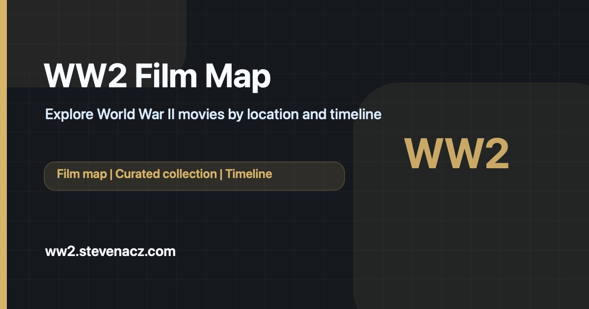

# WW2 Film Map

**Explore World War II through the lens of cinema.**

WW2 Film Map is a public Nuxt application that connects World War II films with the places, years, and historical events they depict. The site is built as a fast, crawlable static experience for maps, film discovery, and timeline exploration.



## Production

- URL: `https://ww2.stevenacz.com`
- Repository: `https://github.com/StevenACZ/ww2-movie-map`

## Features

- Interactive Leaflet map with film locations and historical context.
- Curated film collection with search, sorting, metadata, and trailers.
- World War II timeline from 1936 to 1945 with linked films.
- Responsive Nuxt/Vue interface for desktop and mobile.
- Page-level SEO metadata, canonical URLs, sitemap, manifests, and structured data.

## SEO & Performance

- Static generation through `bun run generate`.
- Shared SEO helpers in `app/utils/seo.ts`.
- Global and page-level JSON-LD rendered as `application/ld+json`.
- `@nuxtjs/sitemap` publishes `sitemap.xml` for the production domain.
- `robots.txt`, `manifest.json`, and `site.webmanifest` are committed under `public/`.
- Content Security Policy is configured in `nuxt.config.ts` for the real image, map, and trailer sources used by the app.

## Tech Stack

- Nuxt 4
- Vue 3
- TypeScript
- SCSS
- Leaflet
- Bun

## Getting Started

### Prerequisites

- [Bun](https://bun.sh/) (required)

### Local Development

```bash
bun install
bun run dev
```

Open [http://localhost:3000](http://localhost:3000) in your browser to view the application.

## Commands

```bash
bun run format
bun run format:check
bun run typecheck
bun run build
bun run generate
bun audit
bun run verify
```

## Deployment

Production deploys are handled by GitHub Actions on pushes to `main`.

The deploy workflow:

- installs dependencies with Bun,
- runs strict format/typecheck/audit checks when available,
- generates the static site,
- publishes the generated public output to the configured production target.

## Project Structure

- `app/pages/`: home, film collection, timeline, and about pages.
- `app/components/`: map, film cards, trailer modal, timeline, and shared UI.
- `app/composables/`: Leaflet map and timeline logic.
- `app/utils/seo.ts`: shared SEO, canonical URL, and JSON-LD helpers.
- `data/`: public film and historical event data.
- `public/`: icons, manifests, robots, security policy contact, and social image.

## License

This project is open source and available under the [MIT License](LICENSE).
