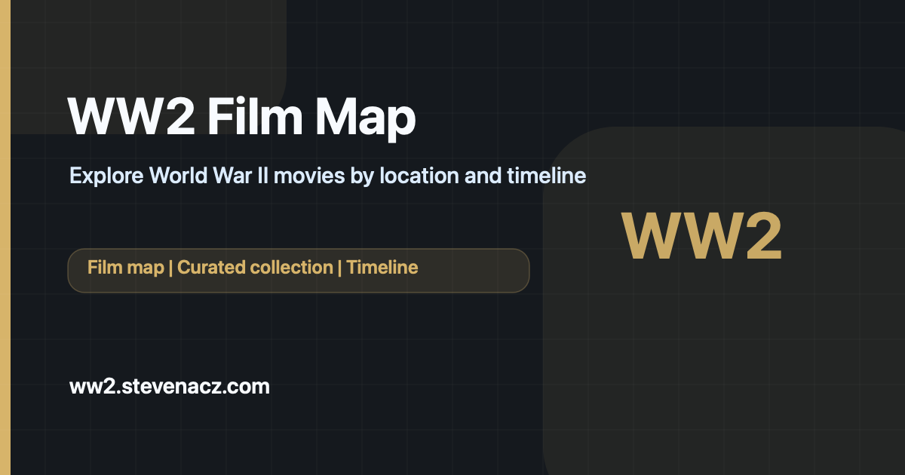

# WW2 Film Map

**Explore the world wars through the lens of cinema.**

WW2 Film Map is a bilingual (English and Spanish) static site that places 222 films and series about the First World War, the interwar years, and the Second World War on an interactive 3D globe, next to the places, fronts, and historical events they depict.



## Production

- URL: `https://ww2.stevenacz.com` (English) and `https://ww2.stevenacz.com/es/` (Spanish)
- Repository: `https://github.com/StevenACZ/ww2-movie-map`

## Features

- Own three.js globe with historical borders for 1914, 1920, 1930, 1938, and 1945; no map tiles or map API keys.
- Timeline from 1914 to 1945 that recolors countries by side or by war status and animates tanks, ships, planes, and front lines.
- Historical events on the globe and on a dedicated timeline page.
- Every title has a journey of story locations that can be followed on the globe.
- Collection of films and series with era pages for WW1, the interwar years, and WW2, plus a curated set of must-watch classics.
- Title pages with synopsis, historical context, trailer, and where-to-watch providers.
- Place pages that connect locations to every title set there.
- Page-level SEO: canonical and hreflang links, Open Graph, JSON-LD, sitemap, manifests, and `llms.txt`.
- Accessible and responsive: keyboard support, visible focus, reduced-motion support, and content available without JavaScript.

## Tech Stack

- Nuxt 4 (static generation), Vue 3, TypeScript, SCSS
- three.js and topojson-client
- `@nuxtjs/i18n` and `@nuxtjs/sitemap`
- Lenis and Fontsource variable fonts
- Bun

## Getting Started

### Prerequisites

- [Bun](https://bun.sh/) 1.4.1 or newer

### Local Development

```bash
bun install
bun run dev
```

Open [http://localhost:3000](http://localhost:3000) to view the site.

### Static Build

```bash
bun run generate
```

The static site is written to `dist/public`.

## Commands

```bash
bun run format
bun run format:check
bun run typecheck
bun run generate
bun run verify
bun scripts/data/validate.ts
bun scripts/geo/build-borders.ts --check
bun scripts/tmdb/sync.ts
```

`bun scripts/tmdb/sync.ts` refreshes posters, ratings, cast, trailers, and watch providers. It needs a TMDB API key in `TMDB_API_KEY` (or a read token in `TMDB_READ_TOKEN`).

## Project Structure

- `app/globe/`: three.js globe engine.
- `app/pages/`: globe, collection, era, title, place, timeline, and about pages.
- `app/components/`: page areas and shared UI.
- `server/`: build-time dataset and prerendered JSON payloads.
- `data/`: titles, events, operations, places, countries, and TMDB metadata.
- `public/geo/`: historical border files and their license.
- `scripts/`: data validation, Wikipedia lookup, border builder, TMDB sync, and event image and poster downloads.
- `i18n/locales/`: English and Spanish strings.

## Deployment

Pushes to `main` and a daily schedule run a GitHub Actions workflow that installs dependencies, refreshes TMDB data when a key is configured, runs the checks, generates the static site, and publishes it to the production host.

## Data Sources and Credits

- **TMDB**: ratings and metadata. This product uses the TMDB API but is not endorsed or certified by TMDB.
- **JustWatch**: where-to-watch provider data, supplied through TMDB.
- **historical-basemaps** (`aourednik/historical-basemaps`): historical borders, licensed under GPL-3.0. See `public/geo/LICENSE-historical-basemaps.txt`.
- **Wikipedia and Wikidata**: historical context and identifiers, licensed under CC BY-SA.
- **Posters**: film and series posters from their Wikipedia articles, shown at small size to identify each title.
- **Freesound**: sound effects, CC0 and CC BY 4.0 recordings by juskiddink, duckduckpony and others. Authors, sources, and licenses for each file are listed in `public/audio/CREDITS.md`.
- **Wikimedia Commons**: timeline event images (public domain, CC0, CC BY, CC BY-SA). Author, license, and source for each image are listed in `data/event-images.json` and shown on its card.

## License

No license file is published for the application code. Third-party data keeps its own license as listed above.
